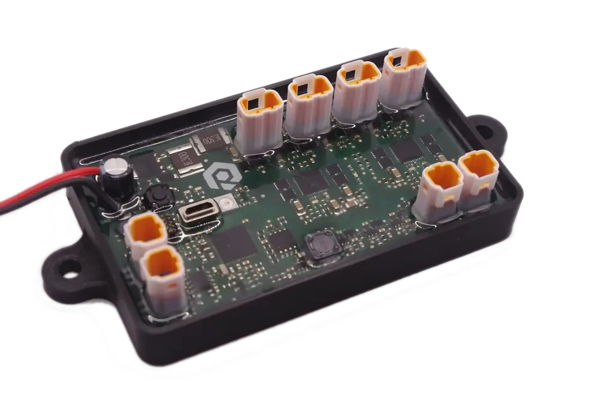

# ROX Integrated Control Unit (ICU)

Software and documentation for ROX Integrated Control Unit

## Description



ROX Integrated Control Unit (ICU) is a modern, open-source alternative to conventional PLCs, designed for demanding industrial applications. Based on the Adafruit Feather M4 CAN platform, this compact device integrates an automotive-grade microcontroller, digital I/O, analog inputs, and CAN interface into a single, robust package.

## Key Features:

- **Wide operation range** 10V to 40V Operating Supply Range, 65V Tolerant
- **Industrial-Grade I/O:**
    - 8x configurable digital I/O channels (up to 40V and 1.2A per channel) with overcurrent protection and comprehensive diagnostics.
    - Per-Channel Configurability Enables Wide Range of
Applications
        - Digital Output: High-Side (HS) Switch or Push-Pull
        (PP) Driver
        - Digital Input: Software Selectable Type 1 and 3, or
        Type 2
        - Current Limit Settable from 130mA to 1.2A
        - Independent Channel Powering
    - Fault Tolerant with Built-In Diagnostics
        -  Voltage Supply Monitoring and Short-to-
VDD Detection
        - Open-Wire/Open-Load Detection
        - Thermal Shutdown Protection,
        - Watchdog Timer etc.

    - 2x analog input, 0..10V range, including reference voltage generator.
- **Connectivity:** Pass-through CAN connection for flexible integration.
- **Powerful Processing:** Features a 120MHz Cortex M4 processor with floating-point support, 512KB Flash, and 192KB RAM.
- **Compact Design:** Measures 96 x 57 mm, only slightly larger than a credit card.
- **Environmental Durability:** IP67 rated and shock-resistant, suitable for harsh industrial environments and mobile machinery.
- **Flexible Programming:** Compatible with Arduino, CircuitPython, C/C++ and Rust
- **Open Source:** Fully open-source design allows for customization and adaptation.

The ROX ICU is designed for decentralized control in mobile machinery and as a PLC replacement in challenging environments. It combines the accessibility of the Feather ecosystem with industrial-grade capabilities, offering a versatile solution for modern industrial control applications.


## Required tools

* `mpremote`
* `circup`
* `invoke`


## Repository structure

### Embedded code

* located in `embedded` folder.
* use `invoke` (`tasks.py`) in that folder to manage device.


### PC code

This repository is a conventional python package that can be installed with pip.
`pyproject.toml` is main project file


## Getting started

**note:** This guide is is for Linux systems. If you are using Windows, these instructions should be useable in WSL, no guarantees however.


**note:** using removable drive from docker container is tricky. So `circup` and `invoke` tools are used on the host system.


## Working with device

Most desktop distributions automatically mount the device under `/media/<user>/CIRCUITPY`.

if not automatically mounted, use `./mount_device.sh` script.


### Clean filesystem

to completely erase the device run

    import storage; storage.erase_filesystem()

see also [Troubleshooting](https://docs.circuitpython.org/en/latest/docs/troubleshooting.html)


### Installation

1. install circuitpython on the board
    - put board in bootloader mode (double click reset button). It should register itself as a removable drive.
    - put `.uf2` file on the drive, it should reboot into circuitpython.
2. cd to `embedded` folder.
3. use `invoke -l` to show available management commands


### Runnig code

First determine device serial port with `sudo dmesg | grep tty`

There use `ampy` or `mpremote`:

*  `ampy run <script.py>` (set `AMPY_PORT` env variable first)
*  `mpremote <port> run <script.py>` (use shortcuts for <port>, like `a1` for `/dev/ttyACM1` if required)

### Development docker stack

start dev stack with `docker-compose.yml`

### Pin mapping

output of `dev/show_pins.py`

```
board.A0 board.D14 (PA02)
board.A1 board.D15 (PA05)
board.A2 board.D16 (PB08)
board.A3 board.D17 (PB09)
board.A4 board.D18 (PA04)
board.A5 board.D19 (PA06)
board.BATTERY board.VOLTAGE_MONITOR (PB00)
board.BOOST_ENABLE (PB13)
board.CAN_RX (PB15)
board.CAN_STANDBY (PB12)
board.CAN_TX (PB14)
board.D0 board.RX (PB17)
board.D1 board.TX (PB16)
board.D10 (PA20)
board.D11 (PA21)
board.D12 (PA22)
board.D13 board.LED (PA23)
board.D23 board.MISO (PB22)
board.D24 board.MOSI (PB23)
board.D25 board.SCK (PA17)
board.D4 (PA14)
board.D5 (PA16)
board.D6 (PA18)
board.D9 (PA19)
board.NEOPIXEL (PB02)
board.NEOPIXEL_POWER (PB03)
board.SCL (PA13)
board.SDA (PA12)
```


## Licenses

* The sourcecode is released under the [MIT License](LICENSE)
* Hardware design in `pcb` folder is released under [CC BY-SA 3.0](pcb/license.txt) license.
