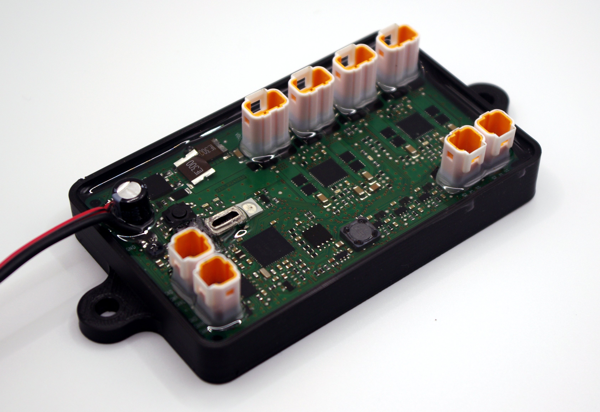

# ROX Integrated Control Unit (ICU)

Software and documentation for ROX Integrated Control Unit

## Description

ROX Integrated Control Unit (ICU) is a modern, open-source alternative to conventional PLCs, designed for demanding industrial applications. Based on the Adafruit Feather M4 CAN platform, this compact device integrates an automotive-grade microcontroller, digital I/O, analog inputs, and CAN interface into a single, robust package.

## Key Features:

- **Wide operation range** 10V to 40V Operating Supply Range, 65V Tolerant
- **Industrial-Grade I/O:**
    - 8x configurable digital I/O channels (up to 40V and 1.2A per channel) with overcurrent protection and comprehensive diagnostics.
    - Per-Channel Configurability Enables Wide Range of
Applications
        - Digital Output: High-Side (HS) Switch or Push-Pull
        (PP) Driver
        - Digital Input: Software Selectable Type 1 and 3, or
        Type 2
        - Current Limit Settable from 130mA to 1.2A
        - Independent Channel Powering
    - Fault Tolerant with Built-In Diagnostics
        -  Voltage Supply Monitoring and Short-to-
VDD Detection
        - Open-Wire/Open-Load Detection
        - Thermal Shutdown Protection,
        - Watchdog Timer etc.

    - 2x analog input, 0..10V range, including reference voltage generator.
- **Connectivity:** Pass-through CAN connection for flexible integration.
- **Powerful Processing:** Features a 120MHz Cortex M4 processor with floating-point support, 512KB Flash, and 192KB RAM.
- **Compact Design:** Measures 96 x 57 mm, only slightly larger than a credit card.
- **Environmental Durability:** IP67 rated and shock-resistant, suitable for harsh industrial environments and mobile machinery.
- **Flexible Programming:** Compatible with Arduino, CircuitPython, C/C++ and Rust
- **Open Source:** Fully open-source design allows for customization and adaptation.

The ROX ICU is designed for decentralized control in mobile machinery and as a PLC replacement in challenging environments. It combines the accessibility of the Feather ecosystem with industrial-grade capabilities, offering a versatile solution for modern industrial control applications.

## What goes where

* `libraries` - board libraries
* `pcb` - hardware documentation
* `examples` - code examples

## Getting started

**note:** using removable drive from docker container is tricky. So `circup` and `invoke` tools are used on the host system.

### Installation

1. install dev tooling on the *host system* with `pip install -r requirements.txt` or create virtual invironment with `prepare_host.sh`
2. install circuitpython on the board
    - put board in bootloader mode (double click reset button). It should register itself as a removable drive.
    - put `.uf2` file on the drive, it should reboot into circuitpython.
3. install required libaries on the board with `invoke install`
4. sync code with the board `invoke sync`

### Runng code

First determine device serial port with `sudo dmesg | grep tty`

There use `ampy` or `mpremote`:

*  `ampy run <script.py>` (set `AMPY_PORT` env variable first)
*  `mpremote <port> run <script.py>` (use shortcuts for <port>, like `a1` for `/dev/ttyACM1` if required)

## Licenses

* The sourcecode is released under the [MIT License](LICENSE)
* Hardware design in `pcb` folder is released under [CC BY-SA 3.0](pcb/license.txt) license.
